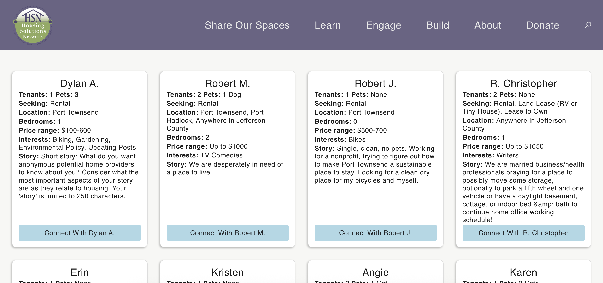
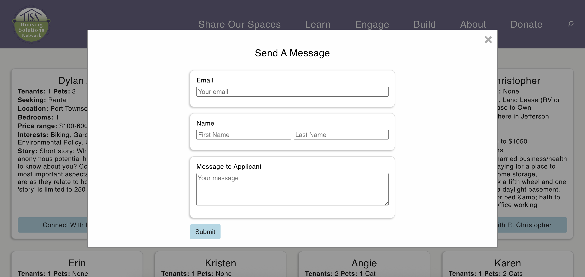
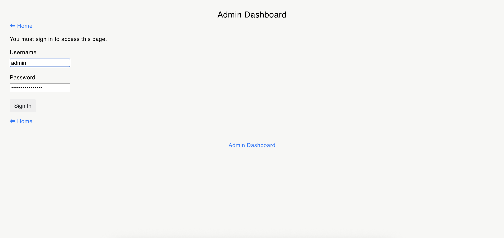
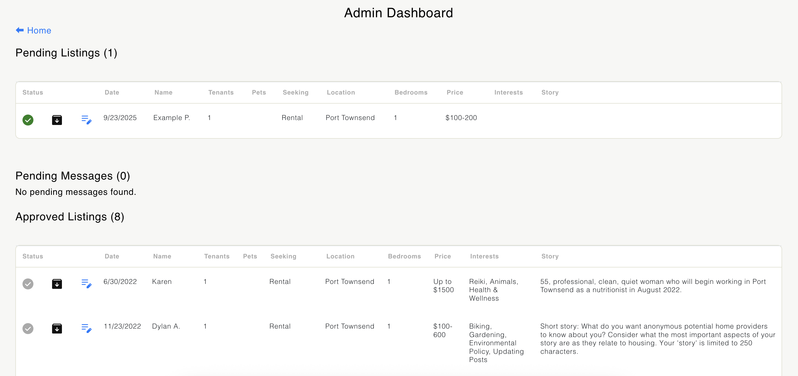

# HSN Housing Link App

A Node.js/Express application for managing housing listings and applicant connections.

## Features
- User authentication
- Applicant and message management
- Admin dashboard

NOTE! When cloning this project, a new MongoDB URI must be implemented! 

## Setup
1. Clone the repo:
   ```
   git clone https://github.com/dyyllaann/hsn-housing-link-app
   ```
2. Install dependencies:
   ```
   npm install
   ```
3. Create a `.env` file with your MongoDB URI:
   ```
   MONGODB_URI=your-mongodb-uri
   ```
4. Start the app:
   ```
   npm start
   ```

## Usage
- Admin credentials are manually updated in MongoDB. Create a username and password to access the admin dashboard. 
- Visit `/login` to sign in.
- Admin dashboard at `/admin`.

## Screenshots



